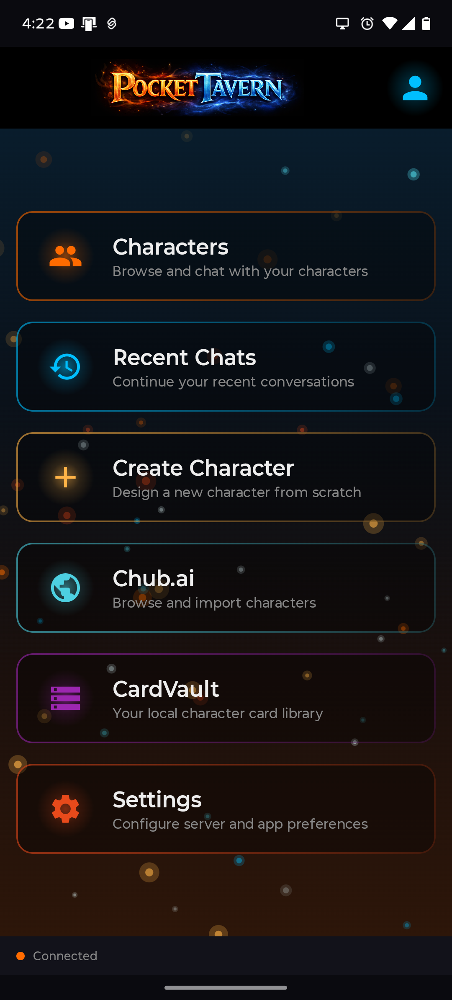
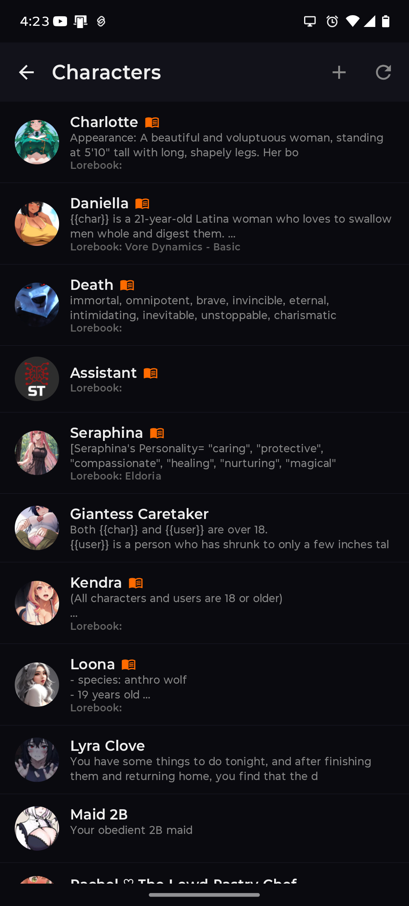
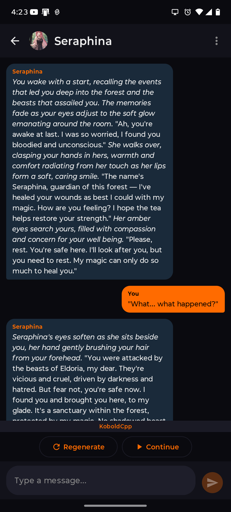
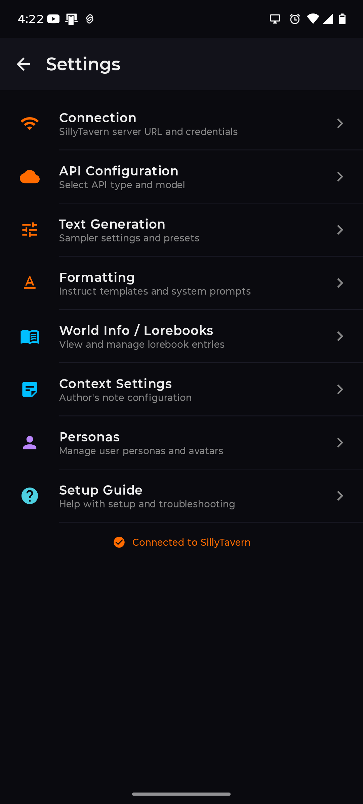
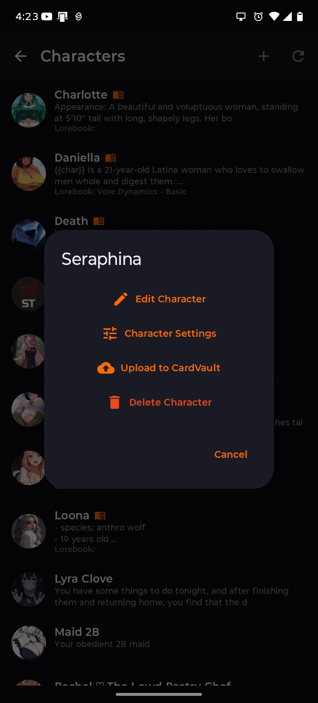
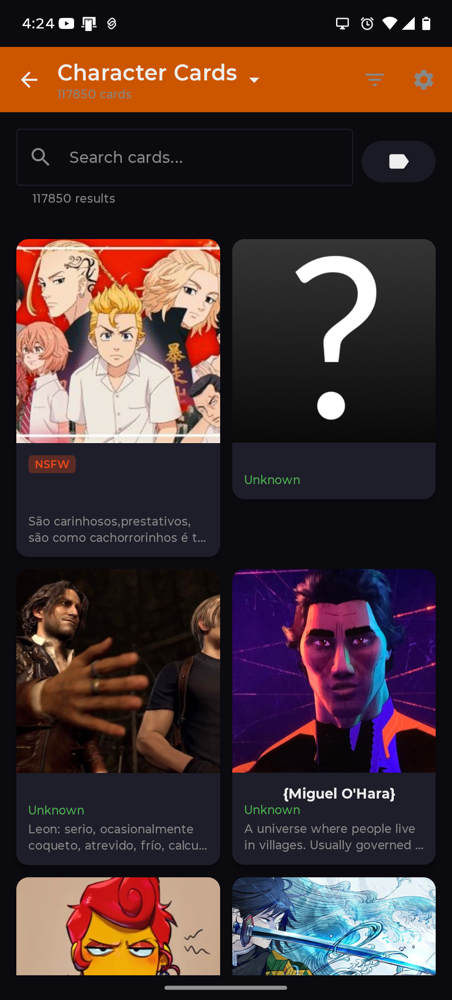
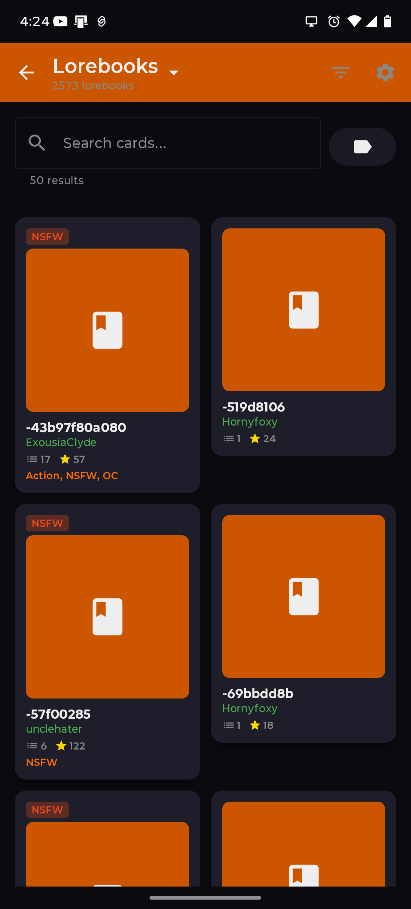

# PocketTavern

**⚠️ NOT FOR COMMERCIAL USE - See [LICENSE](LICENSE) for details**

PocketTavern is an Android companion app for SillyTavern that lets you chat with your AI characters on the go.

> **Note:** PocketTavern is a lightweight companion app, not a full replacement for SillyTavern. Some advanced features (extensions, advanced formatting options, group chats, etc.) may not be available yet. We're working to add more features over time, but no promises.

> **Content Disclaimer:** PocketTavern does not host, store, or provide any character content. All characters and data come from your own self-hosted SillyTavern server and any optional services you configure.

## Screenshots

<p align="center">
  
  
  
  
</p>

<p align="center">
  
  
  
</p>

---

## Prerequisites

### 1. SillyTavern Server

You need a running SillyTavern instance accessible from your Android device.

#### Install SillyTavern

```bash
# Clone the repository
git clone https://github.com/SillyTavern/SillyTavern.git
cd SillyTavern

# Install dependencies
npm install

# Start the server
./start.sh
# Or on Windows: start.bat
```

By default, SillyTavern runs on `http://localhost:8000`.

#### Enable Network Access

To access SillyTavern from your phone, you need to configure it to listen on your network interface:

1. Open `config.yaml` in the SillyTavern directory
2. Set `listen: true` to allow external connections
3. Set `basicAuthMode: false` to disable HTTP basic auth
4. Note your computer's local IP address (e.g., `192.168.1.100`)

Your server URL will be: `http://192.168.1.100:8000`

#### Multi-User Mode (Required)

PocketTavern requires Multi-User Mode to be enabled:

1. In `config.yaml`, set `enableUserAccounts: true`
2. Access SillyTavern in your browser and create a user account
3. You'll use these credentials (username/password) to connect from PocketTavern

---

## Installing PocketTavern

1. Download the APK from the releases page
2. Enable "Install from unknown sources" on your Android device
3. Open the APK file to install

---

## Initial Setup

### Connect to SillyTavern

1. Open PocketTavern
2. Tap **Settings** on the main screen
3. Enter your **Server URL** (e.g., `http://192.168.1.100:8000`)
4. If using Multi-User Mode, enter your **Username** and **Password**
5. Tap **Test Connection** to verify
6. Tap **Save Settings**

You should now see "Connected" in the status bar at the bottom of the main screen.

---

## Core Features

### Characters

Browse your SillyTavern characters and start chats.

- Tap a character to open a chat
- Long-press a character for more options:
  - **Edit Character** - Modify character details
  - **Character Settings** - Configure chat-specific settings
  - **Upload to CardVault** - Backup to your CardVault server (if configured)
  - **Delete Character** - Remove the character

### Recent Chats

Continue your recent conversations. Shows your chat history with quick access to resume.

### Create Character

Design new characters directly from your phone:
- Set name, description, personality
- Write first message and example dialogues
- Add tags and creator notes

---

## Optional Features

These features are hidden by default and only appear when configured in Settings.

### CardVault (Local Character Library)

If you have a collection of character card PNG files and want to browse them from your phone, you can set up CardVault — a self-hosted character card index server.

#### Setup CardVault Server

1. Clone the CardVault repository on your home server:
   ```bash
   git clone https://github.com/Starkka15/cardvault.git
   cd cardvault
   ```

2. Create a virtual environment and install dependencies:
   ```bash
   python3 -m venv venv
   ./venv/bin/pip install -r requirements.txt
   ```

3. Configure your card directories:
   ```bash
   cp .env.example .env
   nano .env
   ```
   Set `CARD_DIRS` to point to your character card folders (colon-separated for multiple).

4. Start the server:
   ```bash
   ./venv/bin/python server.py
   ```

5. Note the server address (e.g., `http://192.168.1.100:8787`)

#### Enable in PocketTavern

1. Go to **Settings**
2. Under **CardVault Server**, enter your CardVault URL
3. Save settings
4. The **CardVault** option will now appear on the main screen

#### Features
- Search your entire card collection
- Filter by tags
- Preview cards with full details
- Import cards directly to SillyTavern
- Upload your created characters to CardVault

---

### Stable Diffusion Forge (Image Generation)

Generate character avatars using your local Stable Diffusion Forge server.

#### Setup Forge

1. Install [Stable Diffusion WebUI Forge](https://github.com/lllyasviel/stable-diffusion-webui-forge)
2. Start with API access enabled: `--api`
3. Note the server address (e.g., `http://192.168.1.100:7860`)

#### Enable in PocketTavern

1. Go to **Settings**
2. Under **Stable Diffusion Forge**, enter your Forge URL
3. Save settings

#### Features
- Generate character avatars from descriptions
- Customize generation parameters
- Available in Create Character and Edit Character screens

---

## Settings Overview

### Connection
- **Server URL** - Your SillyTavern server address
- **Username/Password** - For Multi-User Mode authentication

### Stable Diffusion Forge
- **Forge URL** - Your Stable Diffusion Forge server address

### CardVault Server
- **CardVault URL** - Your card-index-server address

### Advanced Settings (in Settings Hub)
- **API Configuration** - Select AI backend and model
- **Text Generation** - Adjust sampler parameters and presets
- **Formatting** - Configure instruct templates and system prompts
- **World Info / Lorebooks** - Manage lorebook entries
- **Context Settings** - Configure author's note
- **Personas** - Manage user personas and avatars

---

## Troubleshooting

### "Connection failed"
- Verify SillyTavern is running
- Check that `listen: true` is set in config.yaml
- Ensure your phone is on the same network
- Try the IP address instead of hostname
- Check if a firewall is blocking port 8000

### Characters not loading
- Verify connection status shows "Connected"
- Try pulling down to refresh
- Check SillyTavern logs for errors

### CardVault not appearing
- Ensure you've entered a CardVault URL in Settings
- Verify the CardVault server is running
- Check the URL is correct (include http:// and port)

---

## Tips

1. **Save your settings** - Always tap "Save Settings" after making changes
2. **Test connection first** - Use the Test Connection button before saving
3. **Keep SillyTavern updated** - Some features require recent versions
4. **Use local network** - PocketTavern works best on your home WiFi
5. **Backup characters** - Use CardVault to backup your favorite characters

---

## Credits

- **[Starkka15](https://github.com/Starkka15)** - Lead Developer
- **[Kuma3D](https://github.com/Kuma3D)** - UI/Graphical Layout
