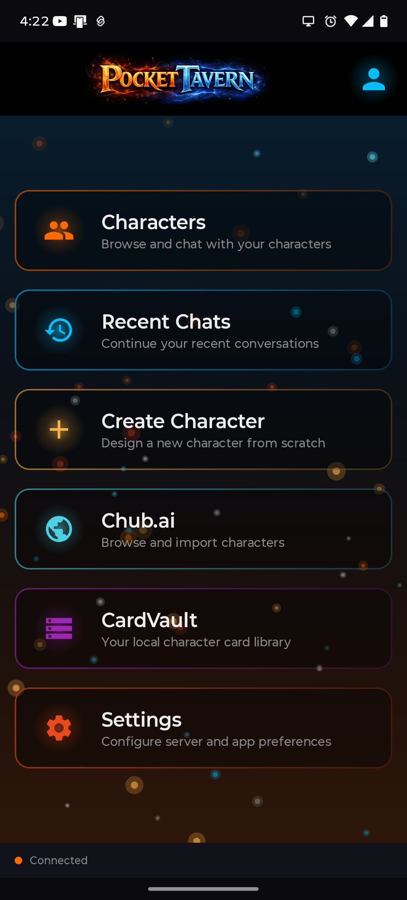
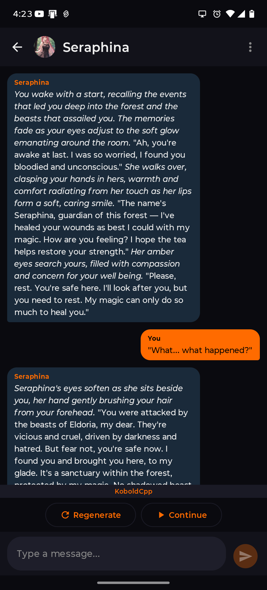
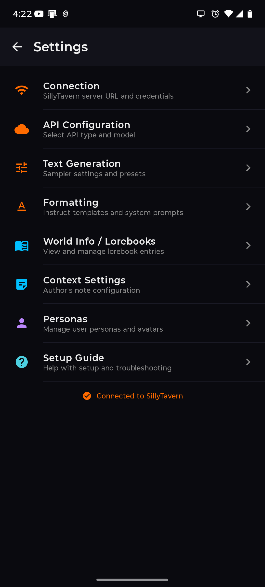
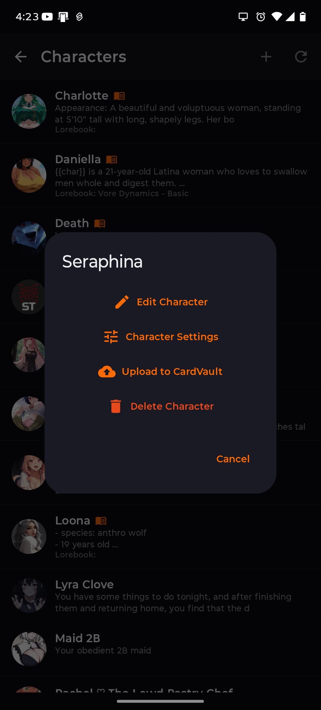
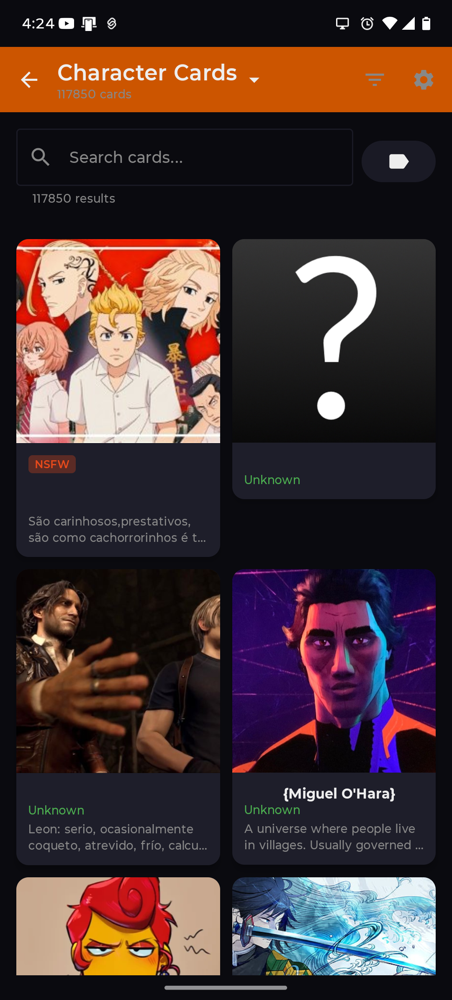
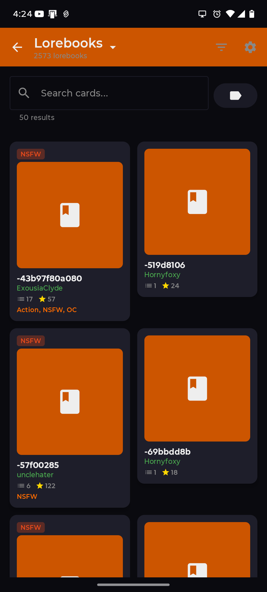

# PocketTavern

**⚠️ NOT FOR COMMERCIAL USE — See [LICENSE](LICENSE) for details**

> **PocketTavern is a fully standalone Android app for chatting with AI characters — no server required.**
> Connect directly to your LLM backend of choice, manage characters and chats locally, and take your AI companions anywhere.

[](https://stt.gg/49Bfn8bA)
[](https://github.com/Starkka15/PocketTavern/releases/latest)
[](https://github.com/Starkka15/PocketTavern/releases/latest)

---

## Why We Went Standalone

PocketTavern started as a companion app for SillyTavern — you needed a running SillyTavern server on your home PC, and the app just connected to it.

**We wanted more than that.**

Going standalone gave us three things: **one app** instead of a phone client tethered to a desktop server, **full control** over the experience without fighting a web UI that wasn't designed for mobile, and the freedom to **build features** that would be difficult or impossible to bolt onto SillyTavern's frontend.

PocketTavern now talks directly to LLM APIs — KoboldCPP, Ollama, OpenAI-compatible endpoints, Anthropic, and more — with no middleman. Characters, chats, and settings all live on your device in a fully SillyTavern-compatible format, so nothing is locked in.

---

## Screenshots

<p align="center">
  
  
  
  
</p>

<p align="center">
  
  
  
</p>

---

## Quick Start

1. Download the APK from the [Releases](https://github.com/Starkka15/PocketTavern/releases/latest) page
2. Enable **Install from unknown sources** on your Android device
3. Open the APK to install
4. Open PocketTavern → **Settings** → **API Configuration**
5. Enter your LLM backend URL and select your model
6. Head to **Characters**, import a PNG card or browse CharaVault — and chat

No Node.js. No PC. No SillyTavern server.

---

## Features

<details>
<summary><b>Chat</b></summary>

### Chat Interface

PocketTavern's chat screen is built around a natural, responsive conversation flow:

- **Streaming responses** — AI output appears word-by-word as it's generated
- **Alternative responses (swipes)** — Swipe left/right on any AI message, or use the `‹ 1/2 ›` arrows that appear below it. The `↺` button at the end of the list generates a fresh alternative. All alternatives are saved alongside the original so you can flip back and forth
- **Edit messages** — Tap any message to edit it directly
- **Delete messages** — Remove individual messages from history
- **Delete From Here** — Long-press a message to delete it and everything after it in one action
- **Continue** — Append to the last AI response without starting a new one
- **Author's Note** — Inject custom text into the context at a configurable depth and frequency
- **Character backgrounds** — Display per-character background images behind the chat
- **Background generation** — Long-running generations continue in a foreground service so Android won't kill them

### Group Chat

Chat with multiple AI characters simultaneously:

- Create groups with any combination of your local characters
- Configure reply order (sequential, random, or activation-based)
- Each character maintains its own persona, description, and world info
- Narrator mode for injecting scene-setting messages

</details>

<details>
<summary><b>Text-to-Speech (TTS)</b></summary>

Have AI messages read aloud using either your device's built-in speech engine or any OpenAI-compatible TTS server.

### Providers

| Provider | How it works |
|----------|-------------|
| **System TTS** | Uses Android's built-in `TextToSpeech` engine — works offline with whatever voices your device has installed |
| **OpenAI-Compatible** | Sends text to any server implementing `POST /v1/audio/speech` — works with OpenAI, Kokoro, AllTalk, XTTS, and others |

### Configuration

Go to **Settings -> Appearance & Audio -> Text-to-Speech**:

- **Provider** — System or OpenAI-Compatible
- **Auto-play** — Automatically speak new AI messages as they arrive
- **Speed** — Playback rate from 0.5x to 2.0x
- **Voice** — Select from available voices (fetched from server for OpenAI-compatible)
- **Filter mode** — Control what gets spoken:
  - *All text* — Speaks everything (markdown stripped)
  - *Quotes only* — Only reads quoted dialogue (`"like this"`)
  - *No asterisks* — Skips action text (`*like this*`)

### Per-Character Voices

Each character can have its own voice and provider override. Set it in the character's settings under **TTS Voice** — the global default is used when no override is set.

### Manual Playback

Long-press any message in chat to access **Speak** and **Stop** options, regardless of auto-play settings.

</details>

<details>
<summary><b>LLM Backends</b></summary>

PocketTavern connects directly to your LLM without any intermediary server. Configure your endpoint once under **Settings → API Configuration**.

| Backend | Type | Notes |
|---------|------|-------|
| **KoboldCPP** | Local | `POST /api/v1/generate` — streaming via `/extra/stream` |
| **Ollama** | Local | `POST /api/generate` or `/api/chat` with streaming |
| **OpenAI-Compatible** | Local / Cloud | Works with LM Studio, TabbyAPI, vLLM, Aphrodite, TextGen WebUI, OpenAI, Mistral, Groq, DeepSeek, and any service following the `/v1/chat/completions` spec |
| **LlamaCpp Server** | Local | `POST /completion` with streaming |
| **Anthropic** | Cloud | Claude models via `POST /v1/messages` |
| **NovelAI** | Cloud | Subscription-based creative writing models |

### Connection Profiles

Save multiple backend configurations and switch between them instantly — useful if you run different models for different characters, or swap between local and cloud depending on your connection.

</details>

<details>
<summary><b>Characters & Cards</b></summary>

### Local Character Storage

Characters are stored as PNG files with embedded metadata — the same format SillyTavern uses. Every card you import or create stays on your device in `/files/characters/`, and can be exported at any time.

- Import any `.png` character card by tapping the import button or sharing a card to PocketTavern
- Create characters from scratch with name, description, personality, first message, scenario, and example dialogues
- Edit any character's details at any time
- Assign a background image per character

### Character Settings (per-character)

Each character can have its own overrides:

- Custom instruct/context template
- System prompt override
- Attached lorebook / world info file
- Token allocation adjustments

### Browse CharaVault & Forge

Browse thousands of community characters directly in the app:

- **CharaVault** — Search by name, tag, or description; preview full card details; import with one tap
- **Forge** — Community character browser with tag filtering

</details>

<details>
<summary><b>Chats & History</b></summary>

Chats are stored as `.jsonl` files in SillyTavern-compatible format — one metadata line followed by one JSON message per line.

- **Recent Chats** home screen — shows your latest conversations sorted by most recently active, with a preview of the last message
- **Multiple chats per character** — start fresh or continue any previous conversation
- **Full chat history** — scroll back through your entire conversation
- **Export** — chats are plain files you can copy/backup at any time

</details>

<details>
<summary><b>World Info & Lorebooks</b></summary>

World Info (lorebooks) inject relevant lore into the AI's context automatically based on what's being discussed.

- Attach lorebooks globally or per-character
- Character cards with embedded `character_book` entries are automatically loaded
- Entries activate when their keywords appear in recent messages
- **Probability** — entries have a configurable activation chance
- **Token budget** — stops injecting once the context budget is used up
- **Recursive scanning** — activated entry content is scanned for additional keyword matches
- **Regex keys** — use `/pattern/flags` as entry keys for advanced matching

</details>

<details>
<summary><b>Prompt Building & Templates</b></summary>

PocketTavern ships with **96+ bundled templates** copied directly from SillyTavern's open-source preset library. You can also create and save your own.

### Instruct Templates (42 bundled)
Instruct format wraps each message in the correct tokens for your model family — ChatML, Llama 3, Mistral, DeepSeek, Alpaca, Command-R, Gemma, and many more.

### Context Templates (34 bundled)
Controls how the character description, persona, scenario, world info, and chat history are assembled into the final prompt.

### TextGen Presets (6 bundled)
Sampler parameter sets — temperature, top-p, top-k, repetition penalty, min-p, etc. Includes Universal-Creative, Deterministic, and others.

### System Prompt Presets (14 bundled)
Ready-to-use system prompts: Roleplay - Immersive, Assistant - Expert, Chain of Thought, and more.

### OpenAI / Chat Completion Presets
For chat-completion APIs (OpenAI, Claude, etc.), configure a prompt order: drag and reorder system prompt blocks, world info injection points, character description, chat history, and custom injections. Each block has configurable role (system / user / assistant) and injection position (in-order or at a specific depth into chat history).

</details>

<details>
<summary><b>Extensions</b></summary>

PocketTavern ships with three built-in native extensions and a **JavaScript extension API** that lets developers build and install their own.

### Built-in Extensions

#### Quick Reply
Pre-defined response buttons appear above the text input. Tap one to instantly send a preset message — useful for common phrases, commands, or choices. Configure sets of buttons per-character or globally.

#### Regex Text Replacement
Apply find-and-replace rules to AI output (and optionally to user messages). Rules support full regular expressions with capture groups. Use cases: strip unwanted tokens, reformat text, clean up model artifacts.

#### Token Counter
Displays a live estimated token count for the current chat context. Useful for knowing when you're approaching your model's context limit.

---

### JavaScript Extension API

PocketTavern includes a WebView sandbox that runs JavaScript extensions. Extensions are installed from a URL and loaded at startup. They can react to chat events, inject text into the prompt, show dialogs, send hidden LLM requests, and persist their own settings.

#### Installing an extension

Go to **Settings -> Extensions -> JavaScript Extensions** and tap **+**. Enter the URL of the extension's `index.js` or its parent folder -- PocketTavern downloads the file and reloads the sandbox automatically.

#### The `PT` global object

Every extension has access to the `PT` global object:

| API | Description |
|-----|-------------|
| `PT.events` | Event name constants (see Events below) |
| `PT.INJECTION_POSITION` | `BEFORE_CHAR_DEFS`, `AFTER_CHAR_DEFS`, `IN_CHAT` |
| `PT.eventSource.on(event, fn)` | Subscribe to a PocketTavern event |
| `PT.eventSource.off(event, fn)` | Unsubscribe from a previously registered handler |
| `PT.extension_settings` | Persistent settings object keyed by extension id |
| `PT.saveSettings()` | Persist `PT.extension_settings` to device storage |
| `PT.log(message)` | Write to PocketTavern's debug log |

#### Core APIs

| API | Description |
|-----|-------------|
| `PT.setExtensionPrompt(id, text, position, depth)` | Inject text into the prompt before the next generation. Position: `PT.INJECTION_POSITION.*`. Pass empty text to clear. |
| `PT.getContext()` | Returns `{ character, recentMessages, personaName, apiType }`. Each `recentMessages` entry has `{ index, text, isUser }`. |
| `PT.sendMessage(text)` | Send a message as the user through the normal generation pipeline. |

#### UI: Message Headers

Display custom header boxes above AI messages (e.g. mood trackers, metadata).

| API | Description |
|-----|-------------|
| `PT.setMessageHeader(index, text, extensionId, collapsibleText)` | Set a header box above the AI message at `index`. Pass `extensionId` for long-press ownership. Optional `collapsibleText` creates a tap-to-expand section below the main text. Pass empty text to remove. |
| `PT.getMessageHeaders(index)` | Get persisted headers for a message. Returns `[{ text, extensionId, collapsibleText }]`. |
| `PT.clearMessageHeader(index)` | Remove the header at a specific message index. |
| `PT.clearAllHeaders()` | Remove all message headers (typically called on `CHAT_CHANGED`). |

Headers are persisted to disk automatically. Multiple extensions can each set their own header on the same message -- they stack vertically.

**Collapsible sections:** Pass a 4th argument to `setMessageHeader` to add a collapsible body. The main `text` is always visible; the `collapsibleText` is hidden behind a tap-to-expand chevron. Useful for hiding detailed metadata (character trackers, scene notes) without cluttering the chat.

#### UI: Header Inline Buttons

Register clickable buttons that render inside the header box. Hidden by default; user long-presses the header to toggle show/hide.

| API | Description |
|-----|-------------|
| `PT.registerHeaderButtons(extensionId, buttons)` | Register inline buttons. Each: `{ label, action }`. Clicking dispatches `BUTTON_CLICKED`. |
| `PT.clearHeaderButtons(extensionId)` | Remove inline buttons for this extension. |

#### UI: Header Context Menu

Pre-register a popup context menu shown when the user long-presses a header.

| API | Description |
|-----|-------------|
| `PT.registerHeaderMenu(extensionId, items)` | Register menu items. Each: `{ label, action }`. Selecting dispatches `BUTTON_CLICKED`. |
| `PT.clearHeaderMenu(extensionId)` | Remove the context menu for this extension. |

**Long-press priority:** If inline buttons are registered, long-press toggles them. Otherwise if a menu is registered, long-press shows the popup. Otherwise `HEADER_LONG_PRESSED` event fires as a fallback.

#### UI: Quick Reply Buttons

Register custom buttons above the chat input.

| API | Description |
|-----|-------------|
| `PT.registerButtons(extensionId, buttons)` | Register buttons. Each button: `{ label, message }` (sends message) or `{ label, action }` (fires `BUTTON_CLICKED` event with `{ action, label }`). |
| `PT.clearButtons(extensionId)` | Remove all buttons registered under `extensionId`. |

#### Output Filters

Strip extension metadata tags from displayed AI messages.

| API | Description |
|-----|-------------|
| `PT.registerOutputFilter(extensionId, pattern)` | Register a regex pattern to strip from displayed text. Applied with case-insensitive flag. |
| `PT.clearOutputFilter(extensionId)` | Remove a previously registered filter. |

The raw (unfiltered) message text is preserved and available via `PT.getContext().recentMessages[i].text`.

#### Dialogs

| API | Description |
|-----|-------------|
| `PT.showEditDialog(title, fields)` | Show a native edit dialog. `fields`: array of `{ key, label, value }`. Returns a `Promise<object\|null>` resolving to `{ key: value }` or `null` if cancelled. |

#### Hidden Generation

| API | Description |
|-----|-------------|
| `PT.generateHidden(prompt)` | Send a prompt to the LLM without adding messages to the chat. Returns a `Promise<string>` with the AI's response. Recent chat history is automatically prepended for context. |

#### Events

| Constant | Data | Fires when... |
|----------|------|---------------|
| `PT.events.MESSAGE_SENT` | message text | The user sends a message |
| `PT.events.MESSAGE_RECEIVED` | `{ text, index, isUser }` | An AI response completes |
| `PT.events.MESSAGE_EDITED` | message index | A message is edited |
| `PT.events.MESSAGE_DELETED` | message index | A message is deleted |
| `PT.events.GENERATION_STARTED` | null | Generation begins |
| `PT.events.GENERATION_STOPPED` | null | Generation ends or is aborted |
| `PT.events.CHAT_CHANGED` | file name | The active chat changes |
| `PT.events.CHARACTER_CHANGED` | character name | The active character changes |
| `PT.events.BUTTON_CLICKED` | `{ action, label }` | A quick reply button with `action` is tapped |
| `PT.events.HEADER_LONG_PRESSED` | `{ messageIndex, extensionId }` | User long-presses a message header |

#### Example extension

```javascript
(function () {
    var EXT_ID = 'word-count';

    PT.extension_settings[EXT_ID] = PT.extension_settings[EXT_ID] || {
        enabled: true
    };

    // React to incoming AI messages
    PT.eventSource.on(PT.events.MESSAGE_RECEIVED, function (data) {
        if (!PT.extension_settings[EXT_ID].enabled) return;
        var words = data.text ? data.text.trim().split(/\s+/).length : 0;
        PT.log('[word-count] Response was ' + words + ' words.');
        PT.setMessageHeader(data.index, 'Words: ' + words, EXT_ID);
    });

    // Inject a system prompt
    PT.eventSource.on(PT.events.GENERATION_STARTED, function () {
        PT.setExtensionPrompt(
            EXT_ID,
            'Keep responses concise.',
            PT.INJECTION_POSITION.AFTER_CHAR_DEFS
        );
    });

    // Handle header long-press
    PT.eventSource.on(PT.events.HEADER_LONG_PRESSED, function (data) {
        if (data.extensionId !== EXT_ID) return;
        PT.registerButtons(EXT_ID, [
            { label: 'Recount', action: 'recount' }
        ]);
    });

    PT.log('[word-count] loaded');
})();
```

#### Extension file layout

```
my-extension/
+-- index.js       <- required
+-- manifest.json  <- optional (name, version, description, author, id)
```

`manifest.json` format:
```json
{
  "id": "my-extension",
  "name": "My Extension",
  "version": "1.0.0",
  "description": "What it does.",
  "author": "your-name"
}
```

Host both files anywhere accessible by URL (GitHub raw, a web server, etc.). The install URL can point directly to `index.js` or to the folder -- PocketTavern appends `/index.js` automatically.

</details>

<details>
<summary><b>User Persona</b></summary>

Set up a persona to tell the AI who it's talking to:

- **Display name** — shown in chat bubbles
- **Description** — injected into the system prompt so characters know who you are
- **Avatar** — your profile picture in the chat interface
- Multiple personas — create different personas for different roleplay scenarios and switch between them

</details>

<details>
<summary><b>Settings & Configuration</b></summary>

### API Configuration
- Select backend type (KoboldCPP, Ollama, OpenAI-compatible, Anthropic, etc.)
- Enter endpoint URL and API key (if required)
- Pick your model from a fetched list or enter manually
- Streaming toggle

### Connection Profiles
- Save multiple named API + model configurations
- Switch profiles from the main screen

### Text Generation Parameters
- Temperature, top-p, top-k, min-p, repetition penalty, context size, response length
- Load/save named presets

### Formatting
- Select instruct template
- Select context template
- Configure system prompt
- Enable/disable individual prompt sections

### OpenAI Preset Editor
- Full drag-and-reorder prompt block editor
- Per-block role and injection mode controls
- Works with any chat-completion-style API

### Settings Categories

Settings are organized into five groups:

- **Connection** — API Configuration, Connection Profiles
- **Generation** — Text Generation Parameters, Formatting, OpenAI Presets
- **World & Characters** — World Info, Character settings
- **Appearance & Audio** — Themes, TTS, Stable Diffusion Forge
- **Utilities** — SillyTavern Import, Extensions, Debug Logging

</details>

<details>
<summary><b>Stable Diffusion Avatar Generation</b></summary>

Generate character avatars using your local Stable Diffusion Forge server.

1. Install [Stable Diffusion WebUI Forge](https://github.com/lllyasviel/stable-diffusion-webui-forge) with `--api` flag
2. Note the server address (e.g., `http://192.168.1.100:7860`)
3. Enter it in **Settings → Stable Diffusion Forge**

Avatar generation is available in the Create Character and Edit Character screens. Supports both txt2img and img2img (upload a reference image for the AI to work from).

If you're using KoboldCpp on the same machine, PocketTavern automatically unloads the language model from VRAM before starting image generation, then reloads it afterwards — so you don't need a second GPU.

</details>

<details>
<summary><b>Appearance & Themes</b></summary>

PocketTavern's visual style is fully themeable. Go to **Settings → Appearance** to import or apply themes.

### Importing a SillyTavern theme

1. In SillyTavern, export a theme from its **User Settings → Themes** panel (saves as a `.json` file)
2. Transfer the file to your Android device
3. In PocketTavern → **Settings → Appearance**, tap **Import SillyTavern Theme (.json)**
4. Pick the file — the theme is applied immediately

Themes are stored in your app's private storage and persist between sessions.

### ZIP Theme Bundles

For themes that include backgrounds, logos, or music, use a `.zip` bundle:

```
mytheme.zip
├── theme.json           (required — colors, particles, config)
├── background.png       (optional — or .gif, .jpg, .webp)
├── logo.png             (optional — or .gif for animated)
└── music.mp3            (optional — or .ogg, .wav)
```

Import the ZIP the same way as a JSON file — PocketTavern detects the format automatically. Max bundle size is 50 MB.

#### Animated backgrounds

Background images can be animated GIFs or animated WebPs. Just name them `background.gif` or `background.webp` and they'll play automatically. The theme's `background_opacity` and `background_image_mode` settings apply to animated backgrounds the same as static ones.

#### Theme logos

Include a `logo.png` (or `logo.gif` for animated) to replace the PocketTavern logo on the main screen with your own branding.

#### Theme audio

Include a `music.mp3`, `music.ogg`, or `music.wav` to play background music when the theme is active. Set `"theme_audio": true` in `theme.json` to enable it, and optionally `"theme_audio_loop": false` for one-shot playback.

---

### PocketTavern theme format

You can author themes specifically for PocketTavern. The format is a simple JSON file with color values expressed as `rgba(r, g, b, a)` strings. You don't need any of the web/CSS fields that SillyTavern uses — only the fields below are read.

#### Supported fields

| Field | Maps to | Notes |
|-------|---------|-------|
| `underline_text_color` | Accent / primary color | Buttons, icons, highlights |
| `main_text_color` | Primary text | Body text, message text |
| `quote_text_color` | Secondary text | Subtitles, timestamps, hints |
| `blur_tint_color` | Surface / card color | Chat bubbles, cards, dialogs — alpha is stripped, color is made opaque |
| `shadow_color` | Background color | App background — alpha is stripped |
| `border_color` | Border / divider color | Separators, card outlines — if alpha ≈ 0, a subtle tint is derived automatically |
| `user_mes_blur_tint_color` | User chat bubble | If transparent, falls back to the accent color |
| `bot_mes_blur_tint_color` | AI chat bubble | Falls back to `chat_tint_color`, then the default |
| `chat_tint_color` | AI chat bubble (fallback) | Used when `bot_mes_blur_tint_color` is absent or transparent |
| `avatar_style` | Avatar shape | `0` = circle (default), `1` = rounded square |
| `italic_text_color` | Italic text color | Color for `*italic*` text in chat messages |
| `code_background_color` | Code background | Background highlight for `` `inline code` `` |

#### Background & Audio fields

| Field | Type | Default | Description |
|-------|------|---------|-------------|
| `background_image` | bool | false | Enable theme background image |
| `background_image_mode` | string | `"fill"` | `"fill"` (crop), `"fit"` (letterbox), or `"stretch"` |
| `background_opacity` | float | 0.3 | Background image opacity (0.0 - 1.0) |
| `theme_audio` | bool | false | Enable background music from theme bundle |
| `theme_audio_loop` | bool | true | Loop the background music |

> **Tip:** User bubble text color is computed automatically — black on light bubbles, white on dark ones.

#### Ignored fields

The following SillyTavern fields exist in `.json` exports but are not applicable to Android and are silently skipped on import:

`italics_text_color`, `font_scale`, `blur_strength`, `chat_display`, `avatar_style` (only 0/1 is used), `noShadows`, `chat_width`, `hideChatAvatars`, `hotswap_enabled`, all `timestamp_*` toggles, `mesIDDisplay`, `messageTimer_enabled`, `scrollLock`, `custom_css`

---

### Included Themes

PocketTavern ships with four built-in themes, each with animated particle effects on the main screen:

- **PocketTavern** (default) — Fire & Ice (hardcoded)
- **Fire & Ice** — The default theme exported as an editable JSON (same look, fully customizable)
- **Midnight Plum** — Purple stars rising + slow-falling diamonds
- **Ember** — Warm embers with bright spark accents

### Particle Effects

Themes can include a `particle_effect` field that defines animated background particles on the main screen. Use a preset name for convenience or define custom layers for full control.

**Preset names:** `embers`, `snow`, `bubbles`, `rain`, `sparkles`, `fireAndIce`, `none`

Preset shorthand:
```json
{ "particle_effect": "rain" }
```

Preset with overrides:
```json
{ "particle_effect": { "preset": "embers", "layers": [{ "count": 50 }] } }
```

Fully custom multi-layer (this is what Midnight Plum uses):
```json
{
  "particle_effect": {
    "layers": [
      {
        "count": 40,
        "shape": "star",
        "direction": "up",
        "size_min": 1.5, "size_max": 4.0,
        "speed_min": 0.1, "speed_max": 0.4,
        "opacity_min": 0.15, "opacity_max": 0.6,
        "glow": true, "glow_radius": 3.0, "glow_opacity": 0.2,
        "rotation": true,
        "colors": ["#BE96FF", "#9B59B6", "#E0C0FF", "#7B68EE"]
      },
      {
        "count": 15,
        "shape": "diamond",
        "direction": "down",
        "size_min": 1.0, "size_max": 3.0,
        "speed_min": 0.08, "speed_max": 0.25,
        "opacity_min": 0.1, "opacity_max": 0.35,
        "glow": true,
        "rotation": true,
        "colors": ["#6A5ACD", "#483D8B", "#9370DB"]
      }
    ],
    "animation_duration": 12000,
    "background_glow": true,
    "background_glow_opacity": 0.06
  }
}
```

**Available shapes:** `circle`, `square`, `diamond`, `star`, `snowflake`, `raindrop`, `cloud`

**Available directions:** `up`, `down`, `left`, `right`, `random`

**Layer properties:**
| Property | Type | Default | Description |
|----------|------|---------|-------------|
| `count` | int | 35 | Number of particles |
| `shape` | string | circle | Particle shape |
| `direction` | string | up | Drift direction |
| `size_min` / `size_max` | float | 2 / 7 | Size range in dp |
| `speed_min` / `speed_max` | float | 0.3 / 0.7 | Speed range |
| `wobble_amplitude` | float | 0.5 | Horizontal sway amount |
| `wobble_frequency` | float | 1.0 | Sway frequency |
| `opacity_min` / `opacity_max` | float | 0.25 / 0.7 | Opacity range |
| `glow` | bool | true | Render soft glow ring |
| `glow_radius` | float | 2.8 | Glow ring size multiplier |
| `glow_opacity` | float | 0.25 | Glow ring opacity |
| `rotation` | bool | false | Spin particles |
| `colors` | string[] | [] | Hex colors (empty = use theme accent) |

### Default Theme — Fire & Ice

This is the built-in PocketTavern default exported as JSON. Use it as a starting point for your own themes:

```json
{
  "name": "Fire & Ice",

  "shadow_color":             "rgba(10, 10, 15, 1)",
  "blur_tint_color":          "rgba(18, 18, 26, 1)",
  "border_color":             "rgba(26, 26, 37, 1)",

  "underline_text_color":     "rgba(255, 107, 0, 1)",
  "main_text_color":          "rgba(238, 238, 238, 1)",
  "quote_text_color":         "rgba(136, 136, 136, 1)",

  "user_mes_blur_tint_color": "rgba(255, 107, 0, 1)",
  "bot_mes_blur_tint_color":  "rgba(26, 42, 58, 1)",
  "chat_tint_color":          "rgba(26, 42, 58, 1)",

  "avatar_style": 0,

  "particle_effect": {
    "layers": [
      {
        "count": 25,
        "shape": "circle",
        "direction": "up",
        "size_min": 2.0, "size_max": 6.0,
        "speed_min": 0.3, "speed_max": 0.7,
        "wobble_amplitude": 0.5, "wobble_frequency": 1.0,
        "opacity_min": 0.25, "opacity_max": 0.6,
        "glow": true, "glow_radius": 2.8, "glow_opacity": 0.25,
        "colors": ["#FF6B00", "#FFB347", "#E84A1B"]
      },
      {
        "count": 15,
        "shape": "snowflake",
        "direction": "down",
        "size_min": 3.0, "size_max": 7.0,
        "speed_min": 0.15, "speed_max": 0.35,
        "wobble_amplitude": 0.6, "wobble_frequency": 0.8,
        "opacity_min": 0.2, "opacity_max": 0.5,
        "glow": false,
        "rotation": true,
        "colors": ["#00BFFF", "#4DD0E1", "#E0F0FF"]
      }
    ],
    "animation_duration": 10000,
    "background_glow": true,
    "background_glow_opacity": 0.10
  }
}
```

### More Examples

Save as a `.json` file and import via the Appearance screen:

```json
{
  "name": "Midnight Plum",

  "shadow_color":             "rgba(12, 10, 22, 1)",
  "blur_tint_color":          "rgba(40, 32, 68, 0.95)",
  "border_color":             "rgba(110, 85, 170, 0.55)",

  "underline_text_color":     "rgba(190, 150, 255, 1)",
  "main_text_color":          "rgba(230, 220, 245, 1)",
  "quote_text_color":         "rgba(160, 140, 200, 1)",

  "user_mes_blur_tint_color": "rgba(110, 75, 190, 0.85)",
  "bot_mes_blur_tint_color":  "rgba(35, 28, 60, 0.85)",
  "chat_tint_color":          "rgba(35, 28, 60, 0.8)",

  "avatar_style": 0,
  "particle_effect": "sparkles"
}
```

A second example with rounded-square avatars, a warm amber accent, and ember particles:

```json
{
  "name": "Ember",

  "shadow_color":             "rgba(14, 10, 8, 1)",
  "blur_tint_color":          "rgba(38, 28, 20, 0.95)",
  "border_color":             "rgba(180, 100, 30, 0.6)",

  "underline_text_color":     "rgba(255, 165, 60, 1)",
  "main_text_color":          "rgba(240, 228, 210, 1)",
  "quote_text_color":         "rgba(185, 158, 120, 1)",

  "user_mes_blur_tint_color": "rgba(180, 90, 20, 0.9)",
  "bot_mes_blur_tint_color":  "rgba(32, 22, 14, 0.9)",
  "chat_tint_color":          "rgba(32, 22, 14, 0.85)",

  "avatar_style": 1,
  "particle_effect": "embers"
}
```

</details>

<details>
<summary><b>SillyTavern Import (Migration)</b></summary>

Already have characters and chats on a SillyTavern server? Migrate everything to PocketTavern in one step:

1. Go to **Settings → Import from SillyTavern**
2. Enter your SillyTavern server URL and credentials
3. Select what to import: characters, chats, lorebooks
4. Tap **Import** — everything is pulled down and saved locally

After import, PocketTavern works completely independently. Your SillyTavern server is no longer needed.

Alternatively, you can import a folder of `.png` character cards directly via the file picker — no server required.

</details>

---

## Content & Legal

> **Content Disclaimer:** PocketTavern does not host, store, or provide any character content. All characters come from your own device or optional third-party services (CharaVault, Forge) that you configure. We have no visibility into what characters or content you use.

> **Personal Use:** This app is designed strictly for personal use. The app ID and package name (`com.pockettavern.app`) are independent of SillyTavern. PocketTavern is not affiliated with, endorsed by, or derived from any commercial product.

---

## Credits

- **[Starkka15](https://github.com/Starkka15)** — Lead Developer
- **[Kuma3D](https://github.com/Kuma3D)** — UI / Graphical Layout
- **[SillyTavern](https://github.com/SillyTavern/SillyTavern)** — Instruct/context/textgen preset templates bundled under their open-source license
